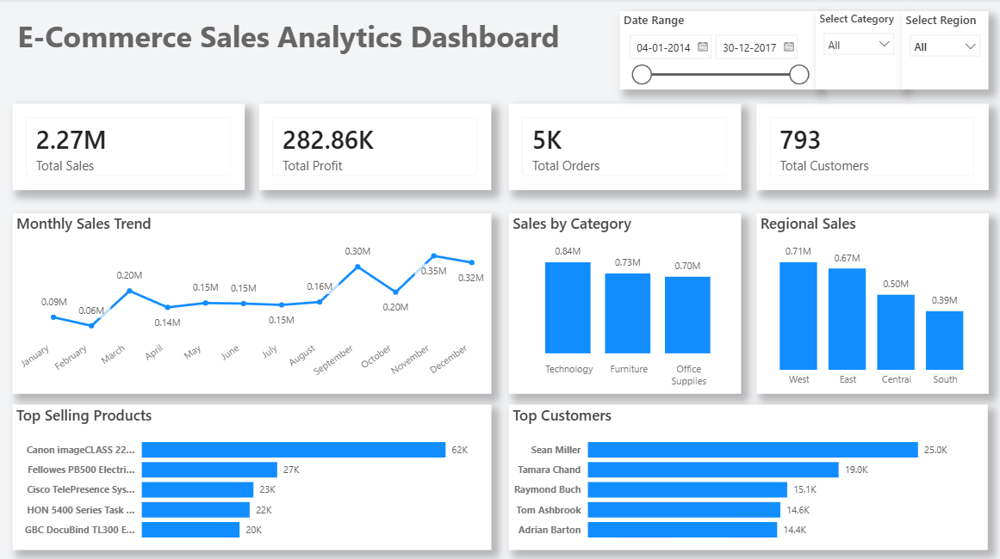

# 📊 E-Commerce Sales Analytics Dashboard

An end-to-end Data Analytics project that analyzes e-commerce sales data using **MySQL** and **Power BI**. The project demonstrates SQL querying, data analysis, and interactive dashboard creation to generate actionable business insights.

---

## 📌 Project Overview

This project analyzes an e-commerce sales dataset containing **9,694 records**. Using SQL, the data is explored and analyzed to answer key business questions. The cleaned data is then visualized in Power BI through an interactive dashboard.

---

## 🛠️ Tools & Technologies

- MySQL Workbench
- SQL
- Power BI Desktop
- Microsoft Excel (CSV Dataset)

---

## 📂 Dataset

- **Records:** 9,694
- **Columns:** 21
- **Source:** Sample Superstore Dataset

---

## 📈 Dashboard Preview



---

## 🎯 Project Objectives

- Analyze overall sales and profit performance.
- Identify top-performing products and categories.
- Evaluate regional sales performance.
- Analyze customer purchasing behavior.
- Build an interactive dashboard for business decision-making.

---

## 📊 Dashboard Features

- Total Sales KPI
- Total Profit KPI
- Total Orders
- Total Customers
- Monthly Sales Trend
- Sales by Category
- Sales by Region
- Top Products
- Customer Segment Analysis
- Interactive Filters (Slicers)

---

## 🗄️ SQL Analysis

The project includes SQL queries covering:

- Database creation
- Data import and validation
- Sales analysis
- Customer analysis
- Product analysis
- Regional analysis
- Time-series analysis
- Common Table Expressions (CTEs)
- Window Functions
- Aggregate Functions
- GROUP BY and ORDER BY
- Ranking and Top-N analysis

---

## 📁 Project Structure

```
Ecommerce-Sales-Analytics/
│
├── dataset/
│   └── SuperStore.csv
│
├── sql/
│   ├── 01_database_setup.sql
│   ├── 02_data_cleaning.sql
│   ├── 03_sales_analysis.sql
│   ├── 04_customer_analysis.sql
│   ├── 05_product_analysis.sql
│   ├── 06_regional_analysis.sql
│   ├── 07_time_analysis.sql
│   └── 08_advanced_sql.sql
│
├── powerbi/
│   └── EcommerceDashboard.pbix
│
├── screenshots/
│
└── README.md
```

---

## 📊 Key Business Insights

- Technology generated the highest sales among all categories.
- Sales performance varied across different regions.
- A small number of products contributed significantly to total revenue.
- Customer purchasing patterns revealed high-value repeat customers.
- Monthly sales trends highlighted seasonal fluctuations.

---

## 🚀 Skills Demonstrated

- SQL Querying
- Data Cleaning
- Data Aggregation
- Business Intelligence
- Dashboard Design
- Data Visualization
- KPI Reporting
- Power BI
- MySQL

---

## 📸 Project Screenshots

### Database

- Database Schema
- Table Structure
- Record Count

### SQL Analysis

- Sales by Category
- Regional Sales
- Top Products
- Monthly Sales
- Advanced SQL (CTE & Window Functions)

### Dashboard

- Dashboard Overview
- Dashboard with Filters
- KPI Cards
- Charts

---
